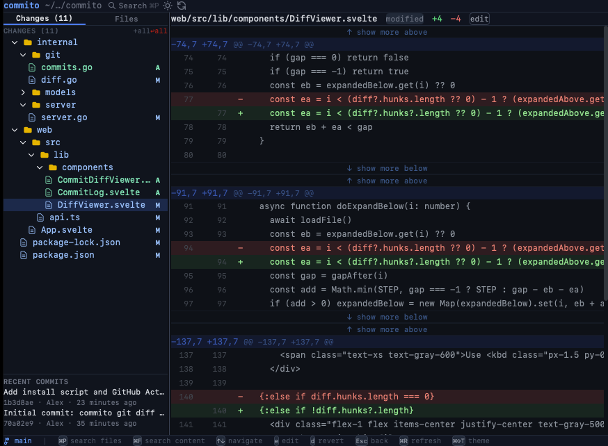

# commito

A local git diff viewer that opens in your browser. Stage, unstage, revert files, and browse diffs — without leaving the terminal workflow.



## Install

```bash
curl -fsSL https://raw.githubusercontent.com/ashuraits/commito/main/install.sh | sh
```

Downloads the binary for your platform and installs it to `/usr/local/bin`.

**Or with Go:**
```bash
go install github.com/ashuraits/commito@latest
```

**Or build from source:**
```bash
make build
```

## Usage

```bash
commito             # opens browser at http://localhost:7171
commito -p 8080     # custom port
commito -d /path    # specify repo directory
commito --no-open   # don't open browser automatically
```

## Update

```bash
commito update
```

Checks for a new release and replaces the binary in place. Restart commito after updating to apply the new version.

## Stack

- **Backend**: Go + embedded Svelte frontend served over HTTP
- **Frontend**: Svelte + TypeScript (built into the binary via `go:embed`)
